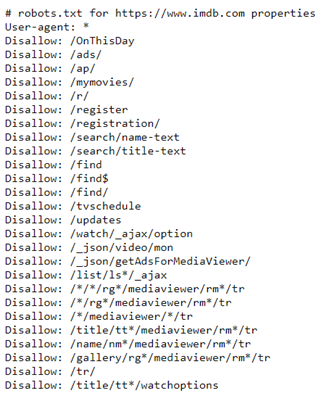

# DS_Final_project
# Question : Film's rating prediction.
## 1. Group infomation

| Tên  |MSSV|email|
|-|:-:|-:|
| Huỳnh Hoàng Huy |1612861|huynhhoanghuy11111998@gmail.com|
| Phạm Hùng Việt |1612809|hungviet0304@outlook.com|

## 2. Detail

 - Data source: https://www.imdb.com/
 - Example url: https://www.imdb.com/search/title/?release_date=2010-10-10,2018-10-10&genres=adventure&languages=en&start=0&ref_=adv_nxt
 - Legality: 
 The bellow picture describes legality of https://www.imdb.com/:
 
 
 
 However, we used /search/title/~ that is not in prohibited zone. So we can freedom crawl it.

 
 - In 8 categories: action, comedy, Adventure,Animation, Crime, Romance, Documentary, Biography
 - Colecting 10000 samples each category
 
 - Total **80000** samples (un-uniqued).
 - Details:
	+ **Title**: name of the film.
	+ **Runtime**: duration of films (**0** if unavailable).
	+ **des**: plot of the movie.
	+ **Date**: year (**0** if unavailable).
	+ **Rating**: how well the film performed (**0** if unavailable).  --> this is the information that we need to *predict*, that is a incomming film.
	+ **Genres**: genres of film 
	
 - Benefit: automatic rating system for new film which has not been released, aka predict how well the movie performed. 
 (example: The film called "Mắt biếc", will be firstly released in VietNam at  20/12/2019. So, all of the rate in other websites are all noise (may some group be hired to vote).
 We need a fair-play automatic rating system.)
 - Motivation: self-thinking
